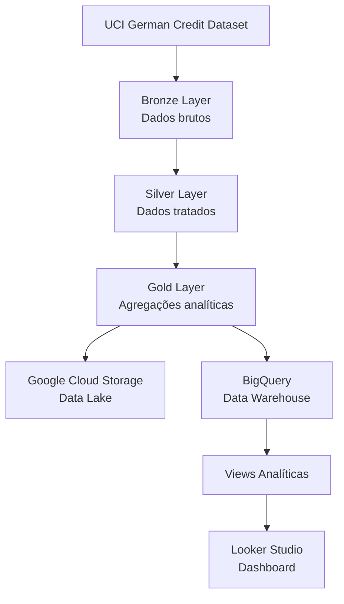

# Arquitetura do Projeto

Esse documento descreve a arquitetura do projeto **Cloud-Native Credit Risk Data Pipeline**, uma evolução cloud-native do projeto original [`credit-risk-data-pipeline`](https://github.com/M1llyz/credit-risk-data-pipeline).

O objetivo dessa V2 foi transformar um pipeline local em uma solução mais próxima de um cenário real de engenharia de dados em nuvem, utilizando **Google Cloud Storage**, **BigQuery** e **Looker Studio**.

---

## Visão Geral

O projeto implementa um pipeline batch para análise de risco de crédito com base no dataset **German Credit Dataset**, seguindo a arquitetura **Medallion**:

- **Bronze**: dados brutos extraídos da fonte original
- **Silver**: dados tratados, padronizados e convertidos para Parquet
- **Gold**: dados agregados e preparados para análise
- **Cloud Storage**: armazenamento dos arquivos por camada
- **BigQuery**: camada analítica e criação de tabelas/views
- **Looker Studio**: dashboard final para exploração visual dos dados

---

## Fluxo Arquitetural



---

## Componentes da Arquitetura

| Componente | Responsabilidade |
|---|---|
| `src/ingestion` | Baixar o dataset original e salvar na camada Bronze |
| `src/processing` | Tratar os dados, aplicar mapeamentos e gerar camadas Silver e Gold |
| `src/cloud` | Enviar arquivos para o Cloud Storage e carregar tabelas no BigQuery |
| `src/config` | Centralizar configurações vindas do `.env` |
| `sql/` | Armazenar scripts de criação de views e consultas analíticas |
| `main.py` | Orquestrar a execução completa do pipeline |

---

## Camada Bronze

A camada Bronze representa o dado em seu estado original, sem transformações analíticas.

O arquivo é baixado diretamente da fonte:

```text
https://archive.ics.uci.edu/ml/machine-learning-databases/statlog/german/german.data
```

Arquivo gerado localmente:

```text
data/bronze/german.data
```

Responsável no código:

```text
src/ingestion/download_data.py
```

A pasta é criada automaticamente neste trecho:

```python
BRONZE_PATH.parent.mkdir(parents=True, exist_ok=True)
```

---

## Camada Silver

A camada Silver contém os dados tratados e padronizados.

Nesta etapa, o pipeline:

- Define nomes de colunas
- Converte o dataset bruto em DataFrame
- Mapeia códigos categóricos
- Cria a coluna `target_label`
- Salva o resultado em Parquet

Arquivo gerado:

```text
data/silver/german_credit_silver.parquet
```

Responsável no código:

```text
src/processing/transform_data.py
```

A pasta é criada automaticamente neste trecho:

```python
SILVER_PATH.parent.mkdir(parents=True, exist_ok=True)
```

---

## Camada Gold

A camada Gold contém datasets agregados, prontos para consumo analítico.

Arquivos gerados:

```text
data/gold/credit_risk_summary.parquet
data/gold/purpose_risk_summary.parquet
data/gold/age_risk_summary.parquet
```

Responsável no código:

```text
src/processing/generate_gold.py
```

A pasta é criada automaticamente neste trecho:

```python
GOLD_DIR.mkdir(parents=True, exist_ok=True)
```

---

## Google Cloud Storage

O Cloud Storage é utilizado como camada de armazenamento em nuvem, simulando um Data Lake.

Estrutura no bucket:

```text
bronze/
silver/
gold/
```

Bucket utilizado no projeto:

```text
credit-risk-platform-bronze-silver-gold
```

---

## BigQuery

O BigQuery é utilizado como camada analítica do projeto.

Após a execução do pipeline, são carregadas as seguintes tabelas:

| Tabela | Origem |
|---|---|
| `german_credit_silver` | `data/silver/german_credit_silver.parquet` |
| `credit_risk_summary` | `data/gold/credit_risk_summary.parquet` |
| `purpose_risk_summary` | `data/gold/purpose_risk_summary.parquet` |
| `age_risk_summary` | `data/gold/age_risk_summary.parquet` |

Dataset utilizado:

```text
credit_risk
```

Região utilizada:

```text
southamerica-east1(São Paulo)
```

---

## Views Analíticas

As views são criadas para facilitar o consumo dos dados no Looker Studio e nas consultas analíticas.

Views criadas:

| View | Objetivo |
|---|---|
| `vw_credit_risk_summary` | Resumo geral por perfil de cliente |
| `vw_purpose_risk_summary` | Análise por finalidade de crédito |
| `vw_age_risk_summary` | Análise por faixa etária |
| `vw_credit_analysis` | View detalhada para exploração |

> [!WARNING]
> As views devem ser criadas manualmente no BigQuery utilizando o conteúdo do arquivo `sql/create_bigquery_views.sql`.

---

## Looker Studio

O Looker Studio consome as views criadas no BigQuery para apresentar os principais indicadores de risco de crédito.

Indicadores exibidos no dashboard:

- Total de clientes
- Ticket médio
- Percentual de bons pagadores
- Percentual de maus pagadores
- Distribuição por perfil de risco
- Perfil de risco por faixa etária
- Clientes por finalidade de crédito
- Ticket médio por finalidade

---

## Observações de Arquitetura

> [!NOTE]
> Esse projeto usa execução batch local, mas com destino cloud. Ou seja, o processamento é executado localmente em Python, enquanto o armazenamento e a análise acontecem em serviços da Google Cloud.

> [!TIP]
> Uma evolução futuro poderá ser mover a execução para Cloud Functions, Cloud Run, Composer/Airflow ou GitHub Actions.

---

## Evoluções Arquiteturais Futuras

Possíveis melhorias:

- Automatizar criação das views no BigQuery
- Adicionar testes automatizados
- Adicionar validações de qualidade dos dados
- Criar infraestrutura com Terraform
- Orquestrar pipeline com Airflow/Cloud Composer
- Implementar CI/CD com GitHub Actions
- Adicionar dbt para modelagem SQL